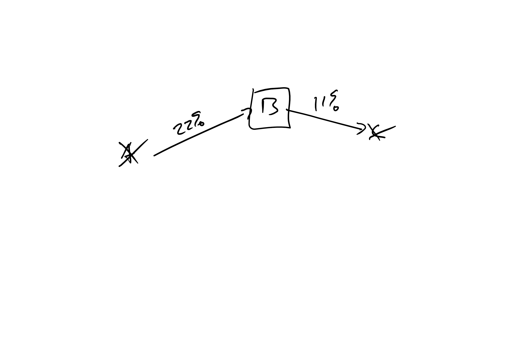
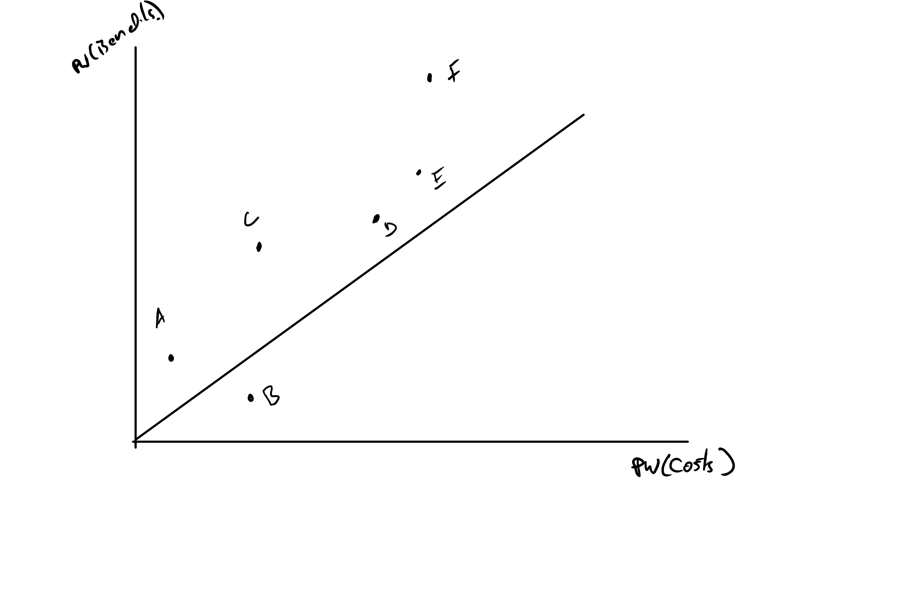
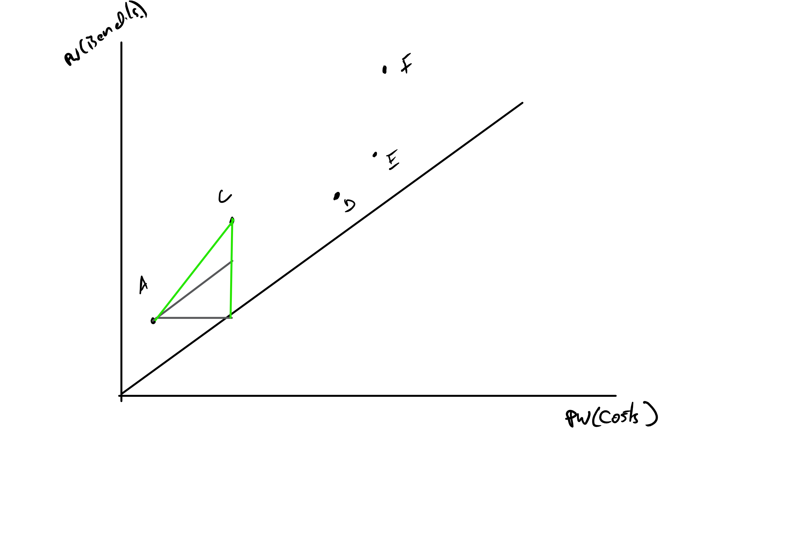

```{r setup, include=FALSE}
knitr::opts_chunk$set(echo = FALSE)
options(scipen=999)

Acc<-function(x){format(x,nsmall=2,digits=2,big.mark=',',scientific=FALSE)}
pgivena<-function(a,i,n){a*((1+i)^n -1)/(i*(1+i)^n)}
pgiveng<-function(g,i,n){g*( (1+i)^n -(i*n) -1  )/(i^2*(1+i)^n)}
agivenp<-function(p,i,n){p*(i*(1+i)^n)/((1+i)^n -1)}
pgivengrow<-function(a1,g,i,n){a1*(1-(1+g)^n*(1+i)^(-n))/(i-g)}


fgivena<-function(a,i,n){pgivena(a,i,n)*(1+i)^n}
fgiveng<-function(g,i,n){pgiveng(g,i,n)*(1+i)^n}

```

## Goals

+ Present a few ways of calculating internal rate of return with cautions.
+ Explain why the IRR criteria is different for loans and investments.
+ Explain the quirks of the exclusive choice procedure.


## What is Internal Rate of Return?

It is an interest rate such that the present worth of an asset is zero.

+ PW is with known $i$.  IRR has a known PW, zero, and you solve for $i$. 
+ It is "an" because multiple internal rates of return are fairly common.

## The Problem

$$PW = A_0 + \frac{A_1}{(1+i)} + \frac{A_2}{(1+i)^2} + \dots +  \frac{A_N}{(1+i)^N}$$

+ Should look like a polynomial
+ Internal rates of return are the roots of this polynomial
+ You can have more than one root.

## Example One Root
$$PW = -10 + \frac{15}{(1+i)^3}$$
```{r, fig.height=5}
curve(-10 + 15/(1+x)^3, from = 0, to = 1)
curve(x*0, from = 0, to = 1, add = TRUE)
```

Note the single root at $\left( \frac{15}{10}     \right)^{\frac{1}{3}} -1 = `r (15/10)^(1/3) - 1`$

## Easy Calculation

Simple case is when you have a value for $A_0$ and then one value in another time period, $A_N$

$$\begin{split}PW = 0 &= A_0 + \frac{A_N}{(1+i)^N}\\
\Rightarrow -A_0 &=\frac{A_N}{(1+i)^N}\\
\Rightarrow i &= \left(  \frac{-A_N}{A_0} \right)^{\frac{1}{N}} -1
\end{split}$$

## Multiple Roots

Descartes' rule of signs:  The number of positive real roots is less than or equal to the number of sign changes in the coefficients of the polynomial.

Year| A | B |
----|---|---|
0   | -10 | -10 |
1   |10 |10  |
2   |10  |-5 | 

+ A Has only one sign change and therefore at most one IRR, i.e., one positive real root.
+ B has two sign changes and therefore *at most* two positive IRRs, i.e, two positive real roots.

## Multiple IRRs
This has IRRs at 10%, 30% and 50%
```{r , fig.height=5}

curve(-1000 + 3900/(1 + x) - 5030/(1 + x)^2 + 2145/(1 + x)^3, 0, .6, ylab = "PW", xlab="i"  )
curve(0 * x, 0, .6, add = TRUE)
```

+ This is -1000, 3900, -5030, 2145
+ Note three  sign changes.

## At Most ...


```{r , fig.height=5}

curve(-1002 + 3900/(1 + x) - 5030/(1 + x)^2 + 2145/(1 + x)^3, 0, .6, ylab = "PW", xlab="i"  )
curve(0 * x, 0, .6, add = TRUE)
```

+ This is -100*2*, 3900, -5030, 2145
+ Only one root.

## Calculating IRR

+ Your calculator will have:
    + IRR function: Works but you need to give it a starting value if there is more than one root.
    + solve: Which is symbolic algebra and is gimped and limits number of cash flows.
    + nsolve: Similar to IRR with a starting value requirement.
+ Spreadsheets
    + IRR( range, [estimated_irr] )
    + Numerical root finder that requires starting value if you have more than one root.

## Try a few

```{r}
library(polynom)


OneIRR <-function(A){
  polyform <- as.function(polynomial(A))
  d <- uniroot(function(x) polyform(x), interval = c(0, 1))$root
  (1-d)/d
}

#OneIRR(c(-10,0,0,15))

```


Year| A | B | C
----|---|---|---
0   | -10 | 10 |-10
1   |0 |0  |7
2   |15  |-15 |7 


## How did you do?


Year| A | B | C
----|---|---|---
0   | -10 | 10 |-10
1   |0 |0  |7
2   |15  |-15 |7 
IRR|`r OneIRR(c(-10,0,15))`| `r OneIRR(c(10,0,-15))`| `r OneIRR(c(-10,7,7))`


+ It should not be a shock that A and B give the same result.
+ BTW I used a numerical solver for this.
+ Lets look at shapes starting with A

## Cost 10 Now and Gives 15 in time 2

```{r , fig.height=5}

curve(-10 + 15/(1 + x)^2 , 0, .6, ylab = "PW", xlab="i"  )
curve(0 * x, 0, .6, add = TRUE)
```

+ PW is zero at `r OneIRR(c(-10,0,15))`.
+ Is investment shaped, costs now and benefits later.
+ If MARR is less than IRR, PW>0 and a good asset.
+ If MARR is greater than IRR, PW<0 and not good.


## Gives 10 Now and Costs 15 in time 2

```{r , fig.height=5}

curve(10 - 15/(1 + x)^2 , 0, .6, ylab = "PW", xlab="i"  )
curve(0 * x, 0, .6, add = TRUE)
```

+ PW is zero at `r OneIRR(c(10,0,-15))`.
+ Is loan shaped, benefits now and costs later.
+ If MARR is less than IRR, PW>0 and a bad asset.
+ If MARR is greater than IRR, PW<0 and good asset.


## Summary Unconstrained Choice Criteria

+ If the asset has a single root...
    + and is an investment, buy if $IRR \geq MARR$
    + and is a loan, buy it if $MARR \geq IRR$
+ In words
    + Buy assets with high returns.
    + Take out loans with low rates.
    
## What if there is more than one IRR?

```{r , fig.height=5}

curve(-1000 + 3900/(1 + x) - 5030/(1 + x)^2 + 2145/(1 + x)^3, 0, .6, ylab = "PW", xlab="i"  )
curve(0 * x, 0, .6, add = TRUE)
```

+ It depends on the client
+ Often the clients that ask for IRR don't understand that there can be more than one root.
+ Had a student with real problem that had 100 IRRs.
+ One of my first consulting oopses was about IRR.

## True Story

+ Was presenting and asset had two roots.
+ This guy, George, questioned my competence because he thought it wasn't possible.
+ The Chief Economist taught me a more gentle way of treating fools...you lie.  

A lie of omission, not commission.

## An Approach

+ Feel out your client.  If they get that there can be more than one IRR, tell them.
+ If they don't
    + Find out the range for the likely MARR.
    + Only tell them the IRR that leads them to the correct decision and is  reasonably conservative.
+ If they are a long-term client, you can introduce the idea later.
    + Consulting is  a tough teaching gig.
    + Just because everyone nods, doesn't mean they get it.  Lots off emperors new clothes effects.

## Example: MARR<10\%

```{r , fig.height=5}

curve(-1000 + 3900/(1 + x) - 5030/(1 + x)^2 + 2145/(1 + x)^3, 0, .6, ylab = "PW", xlab="i"  )
curve(0 * x, 0, .6, add = TRUE)
```

+ Notice that the PW > 0 and they should buy it.
+ Tell them 10%
    + Smallest number that
    + Leads them to correct conclusion, "buy",  because IRR>MARR
    
## Example: 30%>MARR>10\%

```{r , fig.height=5}

curve(-1000 + 3900/(1 + x) - 5030/(1 + x)^2 + 2145/(1 + x)^3, 0, .6, ylab = "PW", xlab="i"  )
curve(0 * x, 0, .6, add = TRUE)
```

+ Notice that the PW < 0 and they should NOT buy it.
+ Tell them 10%
    + Smallest number that
    + Leads them to correct conclusion, "Don't Buy", because IRR<MARR    
    
    
## Example: 50%>MARR>30\%

```{r , fig.height=5}

curve(-1000 + 3900/(1 + x) - 5030/(1 + x)^2 + 2145/(1 + x)^3, 0, .6, ylab = "PW", xlab="i"  )
curve(0 * x, 0, .6, add = TRUE)
```

+ Notice that the PW > 0 and they should  buy it.
+ Tell them 50%
    + Smallest number that
    + Leads them to correct conclusion, "Buy", because IRR>MARR    

    
## Exclusive Choice

+ Unconstrained choice  IRR is pretty common.
+ Exclusive choice is not
    + Never saw it in the real world.
    + Only on the  PE exam.
+ Promise me you will never use this in the real world.

## Promise Me

I'm serious, never use this.

## Exclusive Choice IRR

+ Historical algorithm
+ Great for when computation was expensive and decision making was cheap.
+ Economized on computation.  You did it once.
+ After you had that data you could play "What-if" with the MARR as long as you wanted.

## Don't pick asset with largest IRR

Year| A | B |
----|---|---|
0   | -1 | -1000 |
1   |2 |1110  |
IRR|`r 2/1 -1`| `r 1110/1000 -1`|

A has the highest IRR but if MARR is moderate, you want B.

## The Procedure

This procedure has a lot of caveats

+ All assets are investments.
+ All assets have a single IRR
+ All incremental IRRs are unique
+ Only $A_0<0$.  No costs after time zero.

## Incremental IRR

+ Incremental IRR is the internal rate of return of the difference between two cash flows.
+ Often though of as the IRR of upgrading to another asset.
+ Example:

Year| A | B |B-A|
----|---|---|---|
0   | -1 | -1000 |-999|
1   |2 |1110  |1108|
IRR|   |   |`r 1108/999 -1`|

$$IRR(B-A)\neq IRR(B) - IRR(A)$$

## Common Problem with Incremental IRRs

Year| A | B |B-A|
----|---|---|---|
0   | -1 |-3|-2|
1   |0    |6 | 6|
2   |2   |  0 | -2  |

+ Notice that both A and B have one sign change
+ Notice that B-A has two sign changes.  
    + Not two IRRs but the threat is there.
    + This causes problems for the algorithm. 


## The Algorithm

+ Order assets from smallest initial investment to largest.
+ Eliminate all assets with IRR<MARR.
+ Set asset with smallest initial investment as Best Candidate (BC)
+ While assets remain:
    + Set next asset as Challenger (C)
    + If Incremental IRR $\geq$ MARR, Eliminate BC and set C as BC.
    + Else, Eliminate C.
+ Remaining Asset is the best.

## Commentary on the Algorithm
+ Order assets from smallest initial investment to largest.
    + Done so incremental IRRs are all interpreted as investments and you can use IRR>MARR as a test.
+ Eliminate all assets with IRR<MARR.
    + Assets that are not acceptable can't be the best.

## Commentary (Con't)

+ Set asset with smallest initial investment as Best Candidate (BC)
+ While assets remain:
    + Set next asset as Challenger (C)
    
This initializes a loop and creates a series  of tournaments.
    
+ If Incremental IRR $\geq$ MARR, Eliminate BC and set C as BC.
+ Else, Eliminate C.

The uniqueness of IRRs and the ordering by initial investment, coupled with only allowing costs in period zero, allows the easy comparison.

## Example with Computation of All Values

Year| A | B |C  |
----|---|---|---|
0   | -1| -3|-7 |
1   |0  |0  |0  | 
2   | 2  |  5 | 10  |

+ Compute IRRs for all assets.
+ Compute incremental IRRs for all pairs of assets.
+ Use data to follow the algorithm

## IRRs

```{r}
IRRA <- (2/1)^(1/2) - 1
IRRB <- (5/3)^(1/2) - 1
IRRC <- (10/7)^(1/2) - 1
```


Year| A | B |C  |
----|---|---|---|
0   | -1| -3|-7 |
1   |0  |0  |0  | 
2   | 2  |  5 | 10  |
IRR |`r IRRA`| `r IRRB`| `r IRRC`|

Remember $IRR = \left( \frac{-A_N}{A_0} \right)^ {\frac{1}{N}} - 1$ when you only have values in time zero and one other time period.


Try computing IRR(B-A) and IRR(C-A).

 
## Incremental IRRs

```{r}
AB <- (3/2)^(1/2) - 1
AC <- (8/6)^(1/2) - 1
BC <- (5/4)^(1/2) - 1

```

Year| A | B |B-A  |
----|---|---|---|
0   | -1| -3| -2 |
1   |0  |0  |0  | 
2   | 2  |  5 | 3  |
IRR |`r IRRA`| `r IRRB`| `r AB`|


Year| A | C |C-A  |
----|---|---|---|
0   | -1| -7|-6 |
1   |0  |0  |0  | 
2   | 2  |  10 | 8  |
IRR |`r IRRA`| `r IRRC`| `r AC`|

Try IRR(C-B)

## Incremental IRRs (Con't)


Year| B | C |C-B  |
----|---|---|---|
0   | -3| -7|-4 |
1   |0  |0  |0  | 
2   | 5  |  10 | 5  |
IRR |`r IRRB`| `r IRRC`| `r BC`|


## Summary of Data

Asset | IRR     | A   | B     |   C   |
----  |----     |---- |-----  |-----  |
A     |`r IRRA` |     |`r AB` |`r AC` |
B     |`r IRRB` |     |       |`r BC` |
C     |`r IRRC` |     |       |       |

The other half of the incremental IRR matrix is often not given because it is symmetric.

Find the best asset when the MARR is 15%.

## MARR of 15%

Asset | IRR     | A   | B     |   C   |
----  |----     |---- |-----  |-----  |
A     |`r IRRA` |     |`r AB` |`r AC` |
B     |`r IRRB` |     |       |`r BC` |
C     |`r IRRC` |     |       |       |

+ Order assets as A, B ,C because initial costs are 1, 3, and 7 respectively.
+ No assets have IRRs less than MARR
+ A is BC and B is first challenger.
    + IRR(B-A) = `r AB` > MARR, toss A and set B as BC.
    + IRR(C-B) = `r BC` < MARR, toss C.

B is the best asset at 15%.

## Arrow Notation Explained


     

     
## Arrow Notation  MARR 15%

Asset | IRR     | A   | B     |   C   |
----  |----     |---- |-----  |-----  |
A     |`r IRRA` |     |`r AB` |`r AC` |
B     |`r IRRB` |     |       |`r BC` |
C     |`r IRRC` |     |       |       |





## MARR of 20%

Asset | IRR     | A   | B     |   C   |
----  |----     |---- |-----  |-----  |
A     |`r IRRA` |     |`r AB` |`r AC` |
B     |`r IRRB` |     |       |`r BC` |
C     |`r IRRC` |     |       |       |

+ Order assets as A, B ,C because initial costs are 1, 3, and 7 respectively.
+ Eliminate C since IRR(C) = `r IRRC`<MARR
+ A is BC and B is first challenger.
    + IRR(B-A) = `r AB` > MARR, toss A.

B is the best asset at 20%.


## Arrow Notation MARR 20%


Asset | IRR     | A   | B     |   C   |
----  |----     |---- |-----  |-----  |
A     |`r IRRA` |     |`r AB` |`r AC` |
B     |`r IRRB` |     |       |`r BC` |
C     |`r IRRC` |     |       |       |


## Further Intuition on Why the Algorithm works.


## Describe Assets





## Eliminate Unacceptable


## The Loop 





## Loop (Cont)


## Loop (Cont)


## The Last Asset Standing


## More Examples

+ Examples are randomly generated.
+ If you want, download or clone, and knit.  
+ Correct answer and initial ordering are produced but not the steps or arrow diagrams.


## Larger Example

```{r, include=FALSE}
## Helper Functions


## DATA GENERATION

#Generate 6 Random IRR and H_0 with a regression model so that there is an inverse relationship.

AO <- sample(1:30, 6)
IRR <- (40 + (-1) * AO + rnorm( 6, sd = 3))/100
RawIRR <- IRR
IRR <- IRR * 100

#
#
#Generate random matrix 6x6 upper trianglular symetric materic with similar range. The incrementals can be lower than the IRRs but not higher.  The 5% difference may have to be tuned in the future.

IRROverRun <- .05

IncIRR <- matrix(runif(6*6, min = max(.01, min(RawIRR) - IRROverRun), max = max(RawIRR) + IRROverRun), nrow = 6)

# Kill diagonal
diag(IncIRR) <- 0
#make symetric
IncIRR[lower.tri(IncIRR)] <- t(IncIRR)[lower.tri(IncIRR)]
IncIRR <- as.data.frame(IncIRR)
names(IncIRR) <- c("A","B","C","D","E","F")
row.names(IncIRR) <- c("A","B","C","D","E","F")

## Generate MARRS for the questions
sort(RawIRR)
MARRS <- sample(c(min(RawIRR - .01), mean(sort(RawIRR)[1:2]), mean(sort(RawIRR)[2:3]),   mean(sort(RawIRR)[4:5]) ), 4)

## QUESTION/ANSWER GENERATION

#Finds acceptable assets for each MARR and returns letter names
Acceptable <- function(marr) {
  c("A","B","C","D","E","F")[RawIRR >= marr]
}

#Acceptable(.2)

# Ranks the assets from lowest to highest initial cost
AOOrder <- function(){
  c("A","B","C","D","E","F")[order(AO)]
}

#AOOrder()

#Assume from asset1 to asset2 is an investment and not a loan.  Arguments are both characters.
ChallengerWins <- function(marr, asset1, asset2){
  IncIRR[asset1, asset2] >= marr  
}

#ChallengerWins(.35, "A","C")

##
##

BestAsset <- function(marr){
LetterOrder <- c("A","B","C","D","E","F")[order(AO)]
LetterAcceptable <- c("A","B","C","D","E","F")[RawIRR >= marr]

if ( length(LetterAcceptable) == 0) BC <- NA
if ( length(LetterAcceptable) == 1) BC <- LetterAcceptable[1]
if ( length(LetterAcceptable) > 1) {
  TestOrder <- intersect(LetterOrder,LetterAcceptable)
  
  BC <- TestOrder[1]
  for (Challenger in 2:length(TestOrder)) {
    if (ChallengerWins(marr, BC, TestOrder[Challenger])) BC <- TestOrder[Challenger]
  }
}

BC
}

# BestAsset(.1)

```

All values in %.
```{r results = "asis", message=FALSE, warning=FALSE}

library(knitr)
kable(round(cbind(IRR, AO,  IncIRR*100),2))

```


Step 1:  Get the order of the assets right, lowest initial cost to highest `r paste(AOOrder(), collapse=", ")`.


## MARR = `r round(MARRS[1]*100,2)`\%

```{r results = "asis", message=FALSE, warning=FALSE}

library(knitr)
kable(round(cbind(IRR, AO,  IncIRR*100),2))

```

## MARR = `r round(MARRS[1]*100,2)`\%

```{r results = "asis", message=FALSE, warning=FALSE}

library(knitr)
kable(round(cbind(IRR, AO,  IncIRR*100),2))

```

The acceptable assets are: `r paste(Acceptable(MARRS[1]),  collapse=", " )` and the best is `r BestAsset(MARRS[1])`.


## MARR = `r round(MARRS[2]*100,2)`\%

```{r results = "asis", message=FALSE, warning=FALSE}

library(knitr)
kable(round(cbind(IRR, AO,  IncIRR*100),2))

```

## MARR = `r round(MARRS[2]*100,2)`\%

```{r results = "asis", message=FALSE, warning=FALSE}

library(knitr)
kable(round(cbind(IRR, AO,  IncIRR*100),2))

```

The acceptable assets are: `r paste(Acceptable(MARRS[2]),  collapse=", " )` and the best is `r BestAsset(MARRS[2])`.


## How to Study

+ Worked Examples are at the bottom of this page. 
+ Examples ask you to
    + Calculate IRR for simple asset.
    + Calculate and apply AW criteria
    + Apply PW criteria
    + Use the IRR procedure