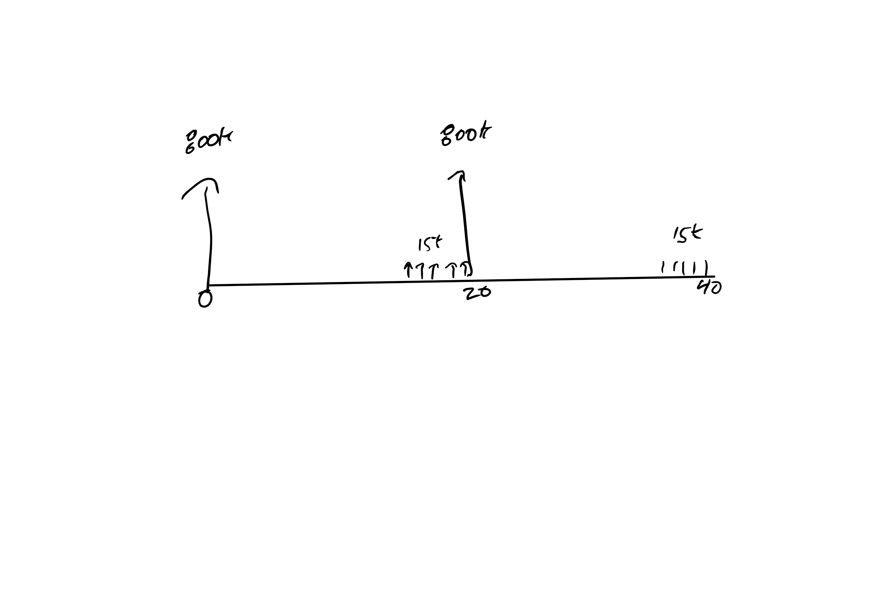

```{r setup, include=FALSE}
knitr::opts_chunk$set(echo = FALSE)
options(scipen=999)

Acc<-function(x){format(x,nsmall=2,digits=2,big.mark=',',scientific=FALSE)}
pgivena<-function(a,i,n){a*((1+i)^n -1)/(i*(1+i)^n)}
pgiveng<-function(g,i,n){g*( (1+i)^n -(i*n) -1  )/(i^2*(1+i)^n)}
agivenp<-function(p,i,n){p*(i*(1+i)^n)/((1+i)^n -1)}
pgivengrow<-function(a1,g,i,n){a1*(1-(1+g)^n*(1+i)^(-n))/(i-g)}


fgivena<-function(a,i,n){pgivena(a,i,n)*(1+i)^n}
fgiveng<-function(g,i,n){pgiveng(g,i,n)*(1+i)^n}

```

## Goals

+ Be able to make a *financial* argument for the choice of one asset over another.
+ Be able to use all the criteria depending on client needs.
+ Do some calculator practice.
+ The third tent pole "Choice" http://ec314-pdx-edu.wikidot.com/q3:choice


## Convergent Development

+ Both Engineering and Economics developed Cost/Benefit analysis ideas in parallel.
+ Many similarities but ...
    + Engineers focus on the money alone and certainty style analysis
    + Economists focus on welfare, money plus opportunity costs, and like the dealing with randomness.
+ The side-effect is a lot of misunderstandings and a lot of complaints about goofiness on all sides.

## There are rule books

Here is one for energy efficiency evaluation.  

https://nationalefficiencyscreening.org/wp-content/uploads/2017/05/NSPM_May-2017_final.pdf

Your industry may, or may not, have one, but you should find out the quirks in the usual rules for your industry.  

Some rules may be odd because of:
  
  + Actual laws and regulations (the details legislators didn't write.)
  + Case law.
  + Local and unwritten past practice.

## Things you need to know to make a choice

+ The kind of choice (Environment), e.g., exclusive choice
+ The assets
+ The minimum acceptable rate of return (MARR), an interest rate
+ The planning horizon
+ The preferred criteria

## Two Environments

We only work with four environments in this class, two now and two later.  

+ *Unconstrained Choice*: Pick the _acceptable_ assets. 
+ *Exclusive Choice*: Pick the _best_ asset. 
+ Increasing Cost of Funds: Pick acceptable assets when you face many interest rates.
+ Capital Budgeting: Pick the best group of assets when limited on how much you can spend.

## How we Describe Assets

+ As a finite menu of choices, e.g., A, B, C, D, E.
+ It could be a list like:
    + French fries, onion rings, cheese sticks, deep fried Oreo.
    + or Cash Flows
    
    Year| A | B | C
----|---|---|---
0   | 0 | 0 |0
1   |10 |0  |0
2   |0  |10 |20 


## More on the assets.

+ Always assume there is only one of each asset.
+ If you need to choose how many.
    + 1 to 3 French Fries in unconstrained choice. {French Fry, French Fry, French Fry} (Rare Econ)
    + 1 to 3 French Fries in exclusive choice. {1 French Fry, 2 French Fry, 3 French Fry} (Eng + Econ)

+ Key Econ vs Engineer Difference
    + Engineers tend to modify the assets but keep the same objective function, i.e., sum the assets and the adder for interaction.
    + Economists will tend to modify the objective function. 
    + Same/similar end result.

## Give Me Examples

+ Give me a list of options that is clearly unconstrained, "Choose the acceptable assets", choice.
+ Give me a list of options that is clearly exclusive, "Choose the best asset", choice.

## MARR

The minimum acceptable (occasionally allowable) rate of return (MARR) is an interest rate.

It is intended to represent the opportunity cost of the investment.  Opportunity cost means what you give up.

+ If investment is funded with a loan, then the opportunity cost is a larger loan at the loan rate.  MARR can be the loan rate.
+ If the investment is funded out of retained earnings, then the opportunity cost is your usual rate of return on investments, i.e., the return on assets (Usually modified)
+ Frequently there is some reference interest rate in use:
    + Mortgage rate
    + State bond rate
    + Growth rate in real GDP.
    
## Sometimes

You have to hold the client's hand and guide them through a process of finding the right real (abstracting out inflation) interest rate and then adding in inflation forecasts.  
    
$$Nominal = Real + Inflation + (Real)(Inflation)$$    
    
Sometimes you are told

+ Ask accounting.
+ There may be a law.
+ Office of Management and Budget (OMB) publishes what you should use https://www.federalregister.gov/documents/2017/01/10/2017-00209/discount-rates-for-cost-effectiveness-analysis-of-federal-programs
+ In this class I will give you the MARR.

## Gotchas

+ If you have constraints, cash flow limitations like the capital budgeting problem, the MARR does not reflect the full opportunity cost.
+ The shadow cost of the constraint is implicitly in the choice but this confuses people.
+ Econ/Engineer difference.
    + Engineers change the procedure to keep present worth calculation easy.
    + Economists switch to constrained optimization.

## Planning Horizon

This is how far into the future you need to look.

+ In this class it is mostly implied by the kind of question.
+ Most important when we are looking at service investments, i.e., when we must provide specific services for a stated number of years.
+ Can be important in determining which asset is best.

One of the first questions for many home improvements is, "How long will you stay in the house?" Not all improvements get reflected in the sales price.

## Example of planning horizon effects.

Low income property development in Oregon

+ For profit and non-profit partner to develop property.
+ Tax credits are received for 15 years.
+ For profit takes the credits and then transfers the property to the non-profit after 15 years.
+ Non-profit must plan for 60 years of operation.

Three groups:

+ Non-profit: Cares about first cost and 60 years of maintenance costs.
+ For-profit: Cares about first cost and 15 years of maintenance costs.
+ Maintenance: Does not care about first costs, only the 60 years of maintenance.


## Result

+ Non-profit balances higher first costs and maintenance.
+ For-profit prefers the lowest first cost of all three groups.
+ Maintenance prefers the highest first costs so that maintenance costs are lower. 

Different planning horizon yields different choices.

## The Three Consistent tests (Summary) 


+ Present Worth
    + Life-cycle cost and benefits ($)
    + Unconstrained: If $PW \geq 0$ get it.
    + Exclusive: Choose largest PW
+ Annual Worth
    + Per-period costs and benefits ($)
    + Unconstrained: If $AW \geq 0$ get it.
    + Exclusive: If assets have the same life, choose asset with largest AW
+ Internal Rate of Return
    + Per-period costs *or* benefits (%)
    + Unconstrained:  If a single IRR exists ...
        + If investment, get it if $IRR \geq MARR$.
        + If loan, get it if $IRR \leq MARR$.
    + Exclusive: IRR Procedure (Later in Class)

<!-- Critieria| Description  | Unconstrainted  | Exclusive | Comments -->
<!-- ----     | ---        |---     |----   | ----         | ---- -->
<!-- PW| Life-cycle costs and benefits| If $PW \geq 0$ buy it| Largest PW | Your workhorse -->
<!-- AW| Per-Period costs and benefits| If $WW \geq 0$ buy it| If assets have same life, Largest AW | Good for repeated purchases. -->
<!-- IRR| Per-dollar costs or benefits| If investment and IRR>MARR, buy it.  If loan and IRR<MARR get it.| The procedure| Great in later environments. -->

## Why the calculation?

This is from the pre-test

Year| A | B | C
----|---|---|---
0   | 0 | 0 |0
1   |10 |0  |0
2   |0  |10 |20 

+ More in the same time period is better, $C \succ B$
+ Same amount sooner is better, $A \succ B$
+ Anything other than these two pure cases requires some computation to trade off  "sooner" and "more" in different time periods, i.e., Time Value of Money calculations.

## Simple Payback common but not one of the three

+ Warning
    + This one is not consistent with the others and does not always give the same choice.
    + In common use as a pre-test

## What is Payback?

+ The payback period is the amount of time you must wait until the *undiscounted* cash flow is zero.
+ Examples

Year| A | B | C
----|---|---|---
0   | -10 | -10 |-10
1   |10 |0  |8
2   |0  |10 |8 

+ A has a 1 year payback.
+ B has a 2 year payback
+ C has a payback between 1 and 2 years
    + Some require precision, i.e., $1 \frac{2}{8}$ years.
    + But, how rare is uniform savings over a year?

## What Does a payback criteria look like?

"Must have simple payback of 3 years or less."

+ Pretty simple, a five year old *or* a legislator can understand it.
+ Does not require an interest rate.
+ Computationally simple.

## How Simple Payback Fails

Year| A | B |
----|---|---|
0   | -10 | -10 |
1   | -10| 6  |
2   |-10  |6 |
3   |-10   | -10   |    
4   |1M   | 6  |
5   |     |...|

+ A is like R&D.  
    + Anything before the payback limit has MARR of 0%.  
    + Anything after $\inf \%$.
    + Great investment with moderate interest rates.
+ B is cyclical with multiple payback periods.
    + Annual worth would work better.
    
    
## Simple Payback Summary

+ Simple
+ Works best with a single cost and a stream of benefits that follow.
+ Often used as a pre-screen before PW/AW/IRR are applied.
+ Not always consistent with the big three tests, fails some good investments and passes some bad ones.
+ There is also a discounted payback criteria. Silk purse out of a sow's ear

Will not test you on this.


## Present Worth Criteria

The criteria are simple:

  + Unconstrained: If $PW \geq 0$ get it.
  + Exclusive: Choose largest PW
  
## Intuition on Unconstrained

+ Visualize an account that earns you and charges you the MARR.
    + If you have spare cash you can put it in and earn interest.
    + If you need money you can borrow at that rate.  
+ Every *good* investment must beat out that account.

## Example

+ You have $10 to invest and you can either buy asset A or put the money in the MARR account at 10%.
+ Notice that the asset gives you more money in period 1, so you would rather do that.

Year| A | MARR | 
----|---|---|
0   | -10 | -10 |
1   |15 |11  |

This is the *future value* point of view, which nobody does because you have to make a bunch of extra calculations and can easily get confused. 

## Example (Con't)

+ You have $10 to invest and you can either buy asset A or put the money in the MARR account at 10%.
+ Notice that the asset gives you more money in period 1, so you would rather do that.

Year| A | MARR | 
----|---|---|
0   | -10 | -10 |
1   |15 |11  |

## Now look at the PW

+ Now calculate the PW for each at the MARR
    + $PW(A) = -10 + \frac{15}{1+.1}$
    + $PW(B) = -10 + \frac{11}{1+.1}$

Year| A | MARR | 
----|---|---|
0   | -10 | -10 |
1   |15 |11  |
PW(10%)| `r -10 + 15/1.1`| 0|

+ Putting money in the MARR account always gives a PW of zero.
+ You beat or tie the MARR account by having a $PW \geq 0$

## Exclusive Choice

The exclusive choice criteria says pick the one with the highest PW.

Year| A | B | 
----|---|---|
0   | -10 | -15 |
1   |15 |18  |
PW(10%) | `r -10 +15/1.1`| `r -15 +18/1.1`|

A has a higher PW and is therefore the best asset of the two.

## Exclusive Choice Intuition

You have 15 to invest.  You can either buy B alone or buy A for 10 and put the remaining 5 in the MARR account.

Year| A |MARR|  B |
----|---|---|----|
0   | -10 | -5| -15 |
1   |15 |5.5| 18  |

Notice that 15 spent on A and the MARR pays off better than 15 spent on B alone. 

Again, this is the future value point of view.
    
+ Notice extra calculations.
+ Easy to screw up.
+ Never do this.

## Example Abstract PW problem

Which asset(s) do you choose when the MARR is 20\%?

Year| A | B | C
----|---|---|---
0   | -10 | -10 |-10
1   |10 |0  |8
2   |0  |15 |8 


## Answer


Year| A | B | C
----|---|---|---
0   | -10 | -10 |-10
1   |10 |0  |8
2   |0  |15 |8 
PW(20%)| `r -10 +10/1.2`| `r -10 + 15/1.2^2`| `r -10 + 8/1.2 + 8/1.2^2`

+ "Which asset" pick the one with the highest PW.
+ "Which assets" pick the ones with weakly positive PW.

## More Real

You have the choice of two 100K mortgages:

+ 15-year loan at 3%.
+ 30-year loan at 4%

Which do you choose when your savings earns 8% per year compounded monthly? 

Hints:

+ Find the payments for each loan.
+ Evaluate the present worth of the payments at your opportunity cost, 8%.

## Solution

+ Payments:
    + $100K(A|P, i =\frac{.03}{12} , 15(12)) = `r Acc(agivenp(100000, .03/12, 15*12))`$
    + $100K(A|P, i = \frac{.04}{12}, 30 (12)) = `r Acc(agivenp(100000, .04/12, 30*12))`$
    
+ PW of payments at $\frac{.08}{12}$
    + $`r Acc(agivenp(100000, .03/12, 15*12))` (P|A, i = \frac{.08}{12} , 15(12)) = `r Acc(pgivena(agivenp(100000, .03/12, 15*12), .08/12, 15*12))`$
    + $`r Acc(agivenp(100000, .04/12, 30*12))` (P|A, i = \frac{.08}{12}, 30(12)) = `r Acc(pgivena(agivenp(100000, .04/12, 30*12), .08/12, 30*12))`$
    
+ Notice
    + The 30-year loan is a better deal given your MARR of 8% compounded monthly.
    + If it was 1% compounded monthly you would prefer the 15-year loan
        + `r Acc(agivenp(100000, .03/12, 15*12))` (P|A, i = .01/12, 15(12)) = `r Acc(pgivena(agivenp(100000, .03/12, 15*12), .01/12, 15*12))`
        + `r Acc(agivenp(100000, .04/12, 30*12))` (P|A, i = .01/12, 30(12)) = `r Acc(pgivena(agivenp(100000, .04/12, 30*12), .01/12, 30*12))`
      
## Note
  
  + IRL We use net cash flow instead of the payment to take into account tax effects.
  + The MARR changes which choice is best.
  + The higher the MARR the greater preference for accepting more costs as long as those costs are pushed into the future.
  
## Real Life Example

Numbers have been changed to make it simpler and more interesting. IRL the PVC roof won.

+ Parkrose High School needed a new roof https://www.google.com/maps/@45.5527135,-122.5397698,192m/data=!3m1!1e3
+ Barrel roof leaked.
+ Two choices:
    + Metal Roof (Like the old one but 'done correctly') would last 40 years and cost $1.5M.
    + PVC Roof would last 20 years and cost 800K to install.  It also requires 15K in additional inspection and maintenance in years 16-20.
+ Note
    + Not an apples to apples comparison as stated.  You need to provide 40 years of roofing services, with both styles of roof.
    + Planning horizon is 40 years.
    + Often called a service investment.  The benefits are the same.  You are just comparing costs.

## Stage 1 Tasks

+ Show a cash flow diagram for the two options.
+ Show the factor notation representation of the two options.

## Cash Flow Diagram



## Notes on figure

+ This is cost convention, common with service investments.
+ If you have down vectors you are in net benefit convention.

## PW

+ $PW(Metal|40 Years) = 1.5M$
+ Several Ways
    + Roof 1 + Roof 2
$$PW(PVC|40 Years) = 800K + \frac{15K(P|A, i, 5)}{(1+i)^{15}} + \frac{800K + \frac{15K(P|A, i, 5)}{(1+i)^{15}}}{(1+i)^{20}}$$
    + You can also do Install + Maintenance
    
## What about the MARR?

IRL there was 1/4% Qualified Zone Academy Bonding  (QZAB) available.

+ Explore the limits of MARR
+ Suppose MARR is 0%.  
    + You can then just add cash flows up.
    + *Metal Roof: 1.5M*
    + PVC Roof: 800K +800K + 15K x 10
+ Suppose the MARR limits out to infinity
    + The future does not matter.  You only need to look at first costs.
    + Metal Roof: 1.5M
    + *PVC Roof: 800K*

The best roof depends on the the MARR.

##  PW vs MARR

```{r}
PW <- function(marr) {
  800 + 800/(1 + marr)^20 + pgivena(15, marr, 5)/(1+marr)^15 + pgivena(15, marr, 5)/(1+marr)^35
}

curve(PW, from = .01 , to = .1, xname = "MARR")
curve(x*0 + 1500, from = .01 , to = .1  , add = TRUE, col = "violet")

```


## What Happened In Reality

+ The PVC option was cheaper.
+ We considered the politics of replacing a 40-year roof that failed in less than 10 years with identical roof with promises that it would be done correctly.
    + Everyone that could be sued had been sued or gone out of business.
    + Non-pecuniary benefits play a part and they are not always monetized.
+ Lucky that the financial and non-financial favored PVC. 
+ If not we would have had to figure out how to monetize the political fallout to make the decision.


## Comments on PW Criteria

+ PW is your workhorse criteria. Use this when things get tough.
+ PW as, "Life-cycle costs and benefits" is very confusing for some people.
+ PW is often not intuitive relative to AW, i.e,  "Per period costs and benefits."
+ Many clients prefer AW.

