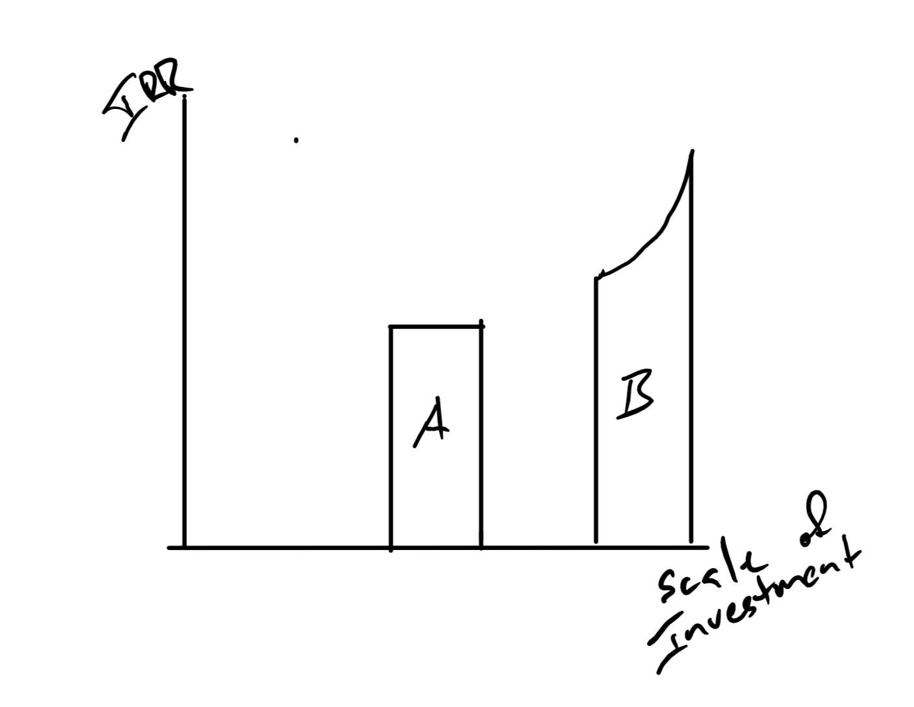
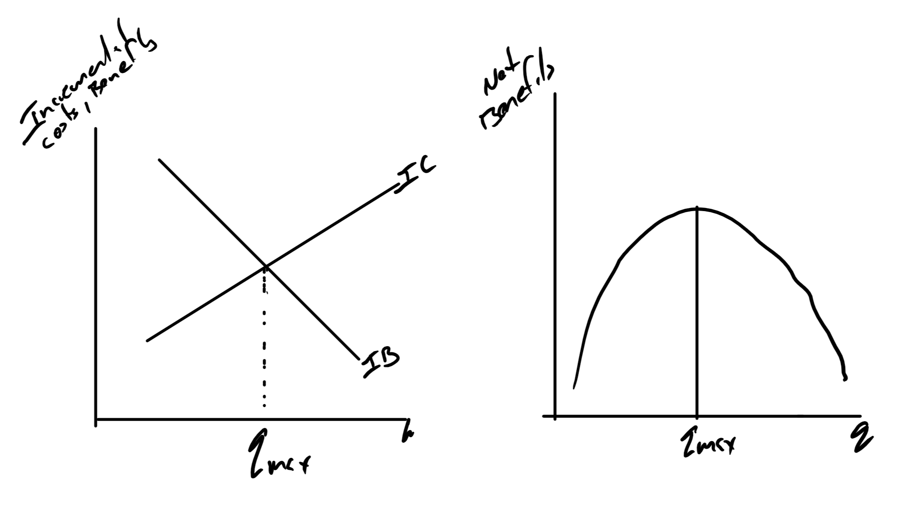
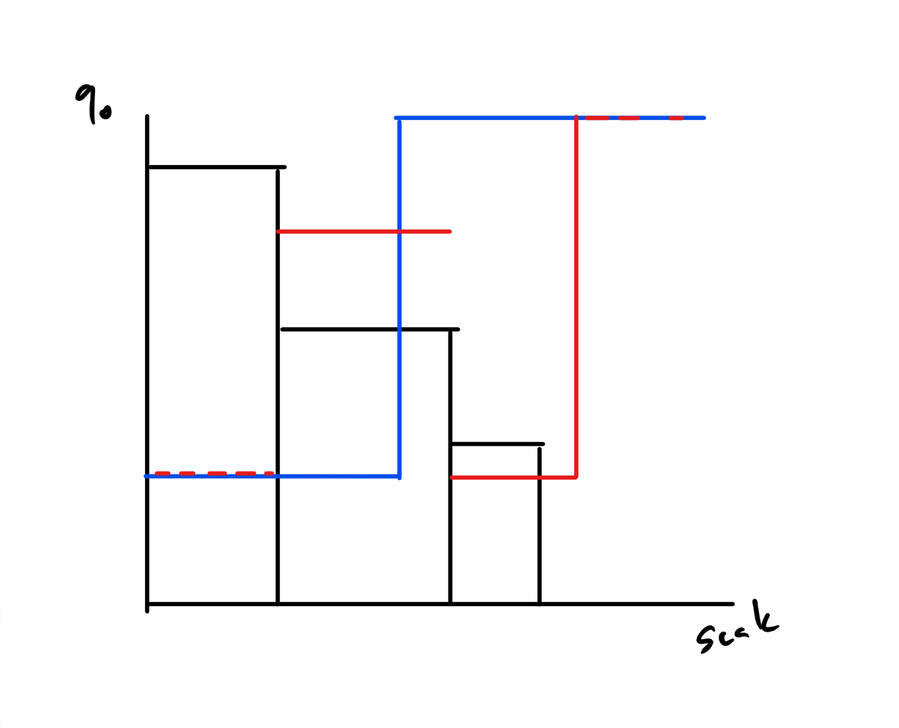

```{r setup, include=FALSE}
knitr::opts_chunk$set(echo = FALSE)
```

## Our Environments

+ Unconstrained Choice: Pick the _acceptable_ assets. 
+ Exclusive Choice: Pick the _best_ asset. 
+ *Increasing Cost of Funds*: Pick acceptable assets when you face many interest rates.
+ *Capital Budgeting*: Pick the best group of assets when limited on how much you can spend.


## There is a general statement of the problem

+ Our environments can be interpreted as mixed integer programming problems with various constraints.
+ You get the good stuff in ETM 535/635, Advanced Engineering Economics
+ Except for trivial problems, you need a heuristic.
+ Heuristics are specialized rules and techniques that find a solution. There are some general categories:
    + Simulated annealing
    + Ant Colony optimization
    + Genetic Algorithms


## The optimization algorithms are fun to use


+ Simulated Annealing
    + Random bounces in parameter space.
    + More  likely to keep those that have smaller evaluations of the objective function than large.
    + Sizes of bounces get smaller over time.
    + Chances of keeping a worse outcome fall over time.
    + Wikipedia has a great graphic https://en.wikipedia.org/wiki/Simulated_annealing#/media/File:Hill_Climbing_with_Simulated_Annealing.gif
+ Genetic Algorithms
    + Like simulated annealing but
    + Many solutions  tried at once.
    + They compete and merge with each other
    + I used these for stochastic dynamic programming problems.


## Not Doing Any of that

+ We will be using some specialized heuristics to find the best sets of assets in the new environments.
+ The two/three heuristics have some fragile points.
    + Increasing cost of funds has trouble when an indivisible asset (defined later), that could be funded by a blend of funds from two sources is rejected and the next asset can be funded by  a  single source of funds.
    + The capital budgeting problem is exhaustive search and the solution requires $2^N -1$ evaluations.

## Increasing Cost of Funds

+ This is an environment similar to unconstrained choice, where you choose as many assets as you wish but no more than one of any given asset.
+ But, you face multiple MARRs from many sources.
    + A MARR for retained  earnings
    + Another MARR for bank loans
    + Another MARR for new stock and bond issuance.


## There is a usual order  for the sources of funds

The order  is based upon uncertainty about results.

+ Less certain results require a higher  MARR
+ More certain results require a lower MARR

Put another way, risky investments require a higher risk premium.

## Why Retained Earnings Require the Lowest MARR

+ These are internal funds that are controlled by internal people.
+ They know you. They know the projects you usually work on.
+ They know the details of the business.
+ They have less uncertainty about those details than an outsider.

Less uncertainty about the result, lower MARR.

## Why a lender sees more uncertainty

+ Lenders tend to specialize in industries.
+ They know the industry well but have less knowledge about the insides of your firm.
+ They don't have full details on the team.
+ They have not worked shoulder to shoulder.

They have more uncertainty than insiders and therefore have a higher MARR.

## Why Capital Markets (Stocks and Bonds) have the highest MARR

+ Many of you own stock, even in a mutual fund or retirement fund.
+ Pick a random stock.
+ Where is the headquarters or the nearest location?
+ You don't know much.  You have more uncertainty.

You have more uncertainty than a banker because you know less about the firm and the project.  Because of that, you will have a higher MARR.

## Distinguishing Divisible and Indivisible Assets

+ Divisible assets
    + You can take some or all.
    + Does not mean any fraction, but close.
    + Think of an apartment complex where you get to chose the number of units.
+ Indivisible Assets
    + You can take all or none.
    + Think of a car.


## Additional Assumption about divisible assets.


No change in  IRR dependent on  scale, but this often happens in real life.




## Logic of the heuristic

+ Not a continuous problem that can be solved by calculus, but you can use calc style logic.
+ Your objective is to maximize *net* benefits, i.e., benefits less costs.
+ In calc land you would set up a net benefit function, differentiate, set it equal to zero and solve.
+ But, that net benefit function has to have the right shape, e.g., $NB''<0$, to be sure that your local extrema is a max and the global max.
+ For this problem, move around the funds and the assets to make sure that it has the right shape for a global maximum  net benefit.


## Getting the right shape of net benefit function.

+ Order your assets from highest IRR to lowest IRR.
+ Order your funds from lowest MARR to highest MARR.


## Use analogy from maximization to pick assets

+ In calc land you would set up a maximization problem
$$\max_q B(q) - C(q)$$
+ Get the first derivative and set it equal to zero
$$B'(q) = C'(q)$$
+ You just find where marginal benefit is equal to marginal cost.
+ You can also think in terms of incremental costs and incremental benefits.
+ *If incremental benefits is greater than incrmental costs, do it.*

## Incremental Benefits and Costs




## Why the "IB>IC Do it" rule


## Application to Divisible Assets

+ This is all dependent on getting the curvature of the net benefit  function right.
+ Right means that the local extrema is a global max.
+ Incremental costs should be  non-decreasing.
+ Incremental benefits should be  non-increasing.
+ Nothing odd happens with divisible assets.

## Divisible asset case

Get all assets and parts of assets where the IRR is greater than MARR.


## Summary of Diagram

+ Vertical is IRR and MARR
+ Horizontal is the scale of investment
+ What gets purchased?
    + A is purchased because $IRR>MARR_{Retained~Earnings}$
    + B is purchased because $IRR>MARR_{Retained~Earnings}>MARR_{Loan~1}$
    + C is partially purchased.
        + Only the part that can be funded by Loan 1 since $IRR>MARR_{Loan~1}$
        + Not the part funded by Loan 2.  $IRR<MARR_{Loan~2}$

## Try Tabular

Asset | A     | B     | C   |  D    |
----  |----   |----   |---- |----   |
IRR   | 20%   | 10%   | 12% | 8%    |
$A_0$ | 6     | 5     | 4   | 7     |

MARR = 9%

In these kinds of problems we only deal with investments and not loans.  No tricks on interpreting the IRR.

## Easy Answer

Asset | A     | B     | C   |  D    |
----  |----   |----   |---- |----   |
IRR   | 20%   | 10%   | 12% | 8%    |
$A_0$ | 6     | 5     | 4   | 7     |

+ MARR = 9%
+ Note that this is just the IRR criteria, "Buy if the IRR is greater than MARR"", i.e., A, B and C.


## Limited Retained Earnings

Asset | A     | B     | C   |  D    |
----  |----   |----   |---- |----   |
IRR   | 20%   | 10%   | 12% | 8%    |
$A_0$ | 6     | 5     | 4   | 7     |

+ \$12 of retained earnings at 9%
+ Line of credit at 12\% available.

## Get the Order Right


Asset | A     | C     | B   |  D    |
----  |----   |----   |---- |----   |
IRR   | 20%   | 12%   | 10% | 8%    |
$A_0$ | 6     | 4     | 5   | 7     |

+ Use $10 of the retained  earnings to buy all of A and C.
+ Use the remaining \$2 to buy 2/5  of B, the part where the $IRR>MARR$.
+ Don't use the the loan to buy remainder of B or D.


## Indivisible Assets

+ It follows the same rules but cost of funds can get complicated.
+ The cost of funds is the weighted average of the funds used.
    + Example: \$7 at 3\% and \$3 at 10\%.
    + $\frac{7}{10} 3\% + \frac{3}{10} 10\% = 5.1\%$
+ You need to convert the *marginal* cost of funds to *Weighted average*, sometimes called *blended*, cost of funds.    
    + The curvature of the net benefit function is *usually* OK.
    + Problems happen when the "IB>IC, Buy It" rule skips a high IRR asset but says to buy less expensive asset with lower IRR. (Picture Later).
    
## Incremental Converted to Weighted Average

Note that the weighted average is still monotonically increasing.


## It can go bad

When middle asset is not purchased, IC is not monotonic.




## Indivisible Assets

Asset | A     | B     | C   |  D    |
----  |----   |----   |---- |----   |
IRR   | 20%   | 10%   | 12% | 8%    |
$A_0$ | 6     | 5     | 4   | 7     |

+ *\$14* of retained earnings at 9%
+ Line of credit at 12\% available.

## Get the Order Right and then


Asset     | A     | C     | B   |  D    |
----      |----   |----   |---- |----   |
IRR       | 20%   | 12%   | 10% | 8%    |
$A_0$     | 6     | 4     | 5   | 7     |
RE (9\%)  | 6     | 4     | 4   | 0     |
Loan (12%)| 0     | 0     | 1   | 7     |
IC Funds  | 9\%   | 9\%   | 9.6\% | 12\%  |

+ Buy A since $IRR > MARR_{RE}$
+ Buy C since $IRR > MARR_{RE}$
+ Buy B since $IRR > MARR_{\frac{4}{5} RE + \frac{1}{5} Loan}$
+ Do not buy D since $IRR < MARR_{Loan}$

## Try again

Asset | A     | B     | C   |  D    |
----  |----   |----   |---- |----   |
IRR   | 20%   | 10%   | 12% | 8%    |
$A_0$ | 6     | 5     | 4   | 7     |

+ *\$12* of retained earnings at 9%
+ Line of credit at 12\% available.


## Solution

Asset     | A     | C     | B   |  D    |
----      |----   |----   |---- |----   |
IRR       | 20%   | 12%   | 10% | 8%    |
$A_0$     | 6     | 4     | 5   | 7     |
RE (9\%)  | 6     | 4     | 2   | _*2*_     |
Loan (12%)| 0     | 0     | 3   | _*5*_     |
IC Funds  | 9\%   | 9\%   | _*10.8\%*_ | _*11.14\%*_  |

You can't calculate the IC funds until you know if the previous asset was purchased.

+ Buy A since $IRR > MARR_{RE}$
+ Buy C since $IRR > MARR_{RE}$
+ Do not Buy B since $IRR < MARR_{\frac{2}{5} RE + \frac{3}{5} Loan}$
+ Do not buy D since $IRR < MARR_{\frac{2}{7} RE + \frac{5}{7} Loan}$


## Increasing Costs of Funds Summary

+ Common environment when funding comes from many sources.
+ In the divisible asset case, take the fractions of assets with $IRR>MARR$.
+ The described heuristic is generally useful but can break in the divisible asset case.
+ The problem is that the weighted average cost of funds is often dependent  on which assets were accepted before.

## Introduction Capital Budgeting

"Capital Budgeting" refers to a problem where you are strictly limited to the amount that can be spent in period zero, but have a defined MARR.

+ Commonly arises in small businesses when you don't have access to lending.
    + The MARR is frequently based on the return on common assets, or
    + the interest rate on your savings.
+ Or, in large organizations when you have separate operating and capital budgets with no ability to transfer.
    + Does not apply in a use it or lose it environment (UIOLI).
    + Very common, but assumes that higher ups understand long-term needs more than lower downs.
    + In UIOLI you buy dumb things
    
## The Heuristic

It is the stupidest one you can use -- "exhaustive search"

+ Form all combinations of your assets.
+ Eliminate all assets that are not feasible, i.e., cost more than you can spend in period zero.
+ Choose the combination with the highest PW.

## Why is it stupid?

Because computation cost grows so quickly.  There are $2^N -1$ proper subsets of a set.

+ Three elements (A, B, C)
    + Pairs ((A,B),(A,C), (B,C))
    + One Trio (A, B, C)
+ 10 Asset Choices, `r 2^10 -1`, combinations.

+ Typical maintenance list for Parkrose had 150-200 items.
    + $1.42 x 10^{45}$ to $1.6 x 10^{60}$ combinations.
    + Only $9.6 x 10^{56}$ atoms in the solar system.
    
    
## Example

Asset     | A   |   B | C   |
----      |---  |---  |---  |
$A_0$     | 2   |  4  | 3   |
PW(10\%) | 2   | 3   | 1   |

With a \$7 capital budget.  Note ABC is not feasible.

Combo |PW   | Combo | PW  |
---   |---  |---    |---  |
A     |2    | AB    | 5   |
B     |3    | AC    | 3   |
C     |1    | BC    | 4   |

AB with \$1 left over is the best combination.

## Observations

+ The MARR does not account for the full opportunity cost of an asset
    + It accounts for the cost of funds.
    + Does not capture the net benefits of assets that are forced out.
        + \$10 available and two assets, one that costs \$8 and another that costs \$3
        + Buying the \$3 assets makes it so you can't get the \$8 asset.
        + The opportunity cost is not just \$3 but the net benefits of the \$8 asset.
        + If you had Calc IV, Lagrange multiplier type effect.
+ Often have  money left over because of the Lagrange type effect.

## A Frequent Problem

You often have capital budgeting/ combinatorial optimization problems in government budgets.

+ Your high IRR project is not funded, but other larger -- lower  IRR -- projects are funded.
+ Your project would have 'bumped' one of the larger projects.
+ Don't argue against the other projects/programs, argue for a larger overall budget.

You should notice this in many budget processes.  There is a strong tendency to commit one-time money, or reduced  contingency, to fund a few high IRR programs.
