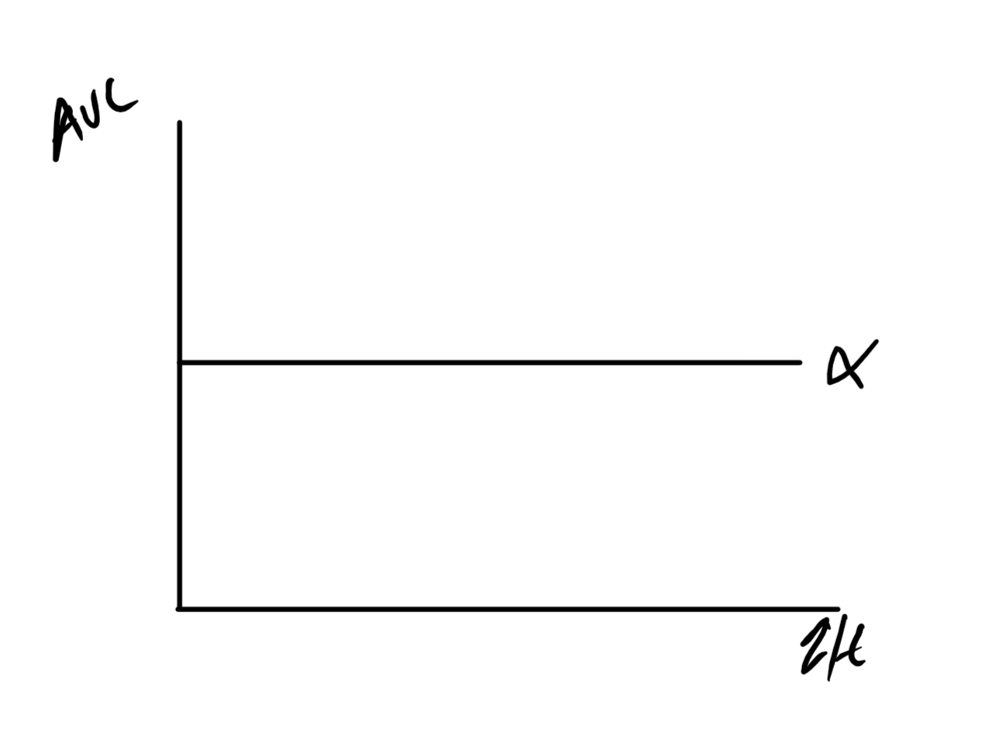
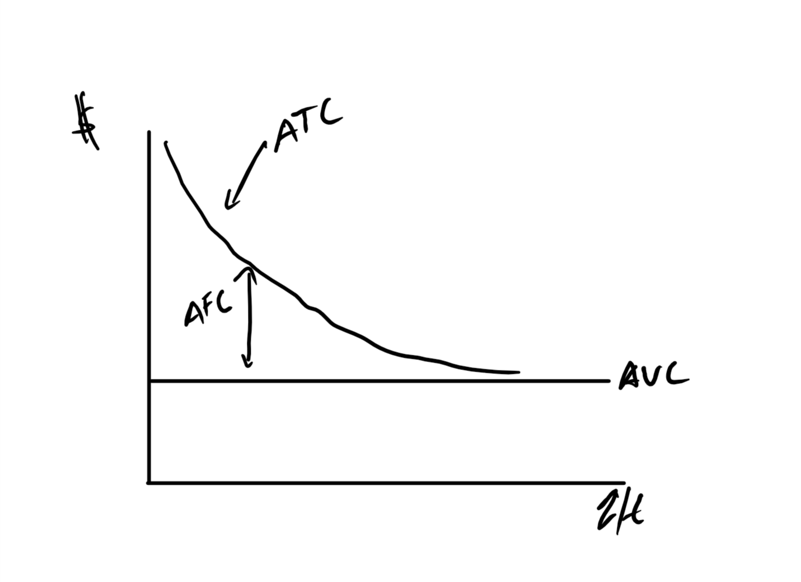
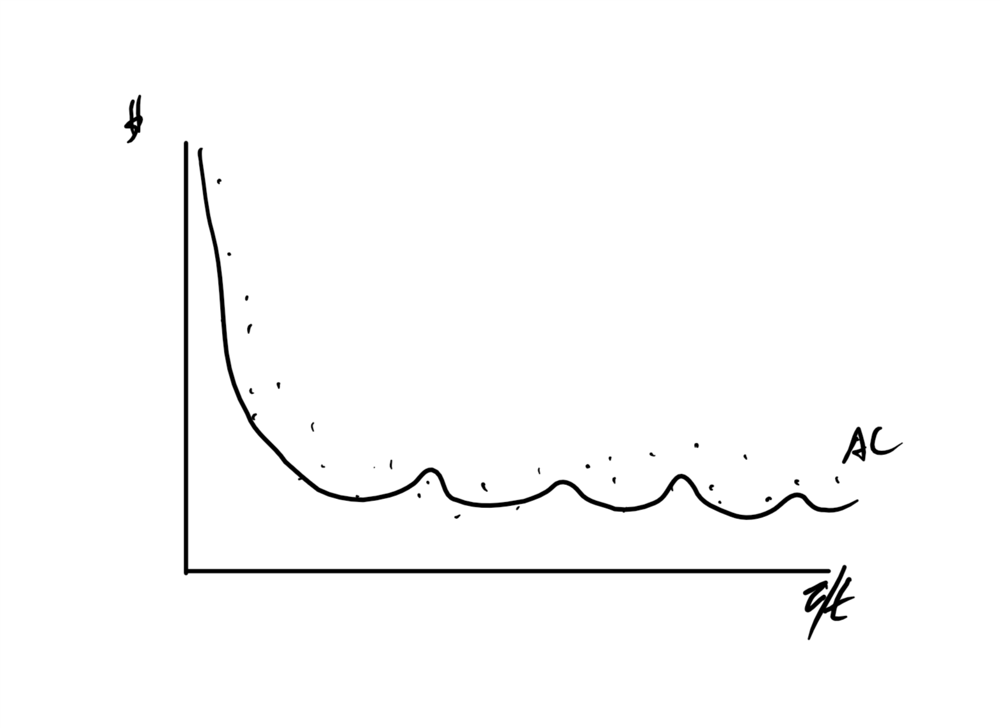
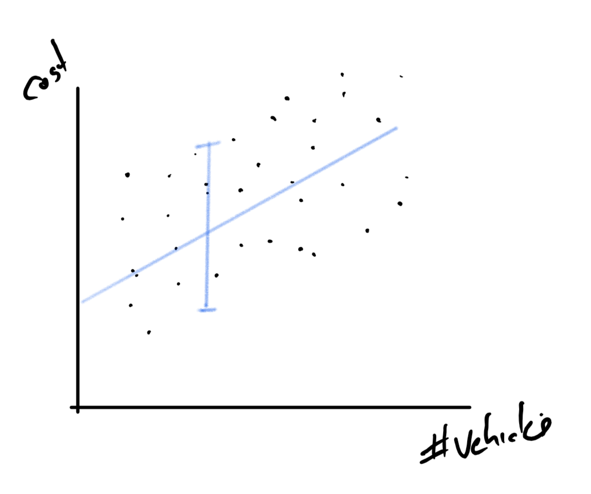
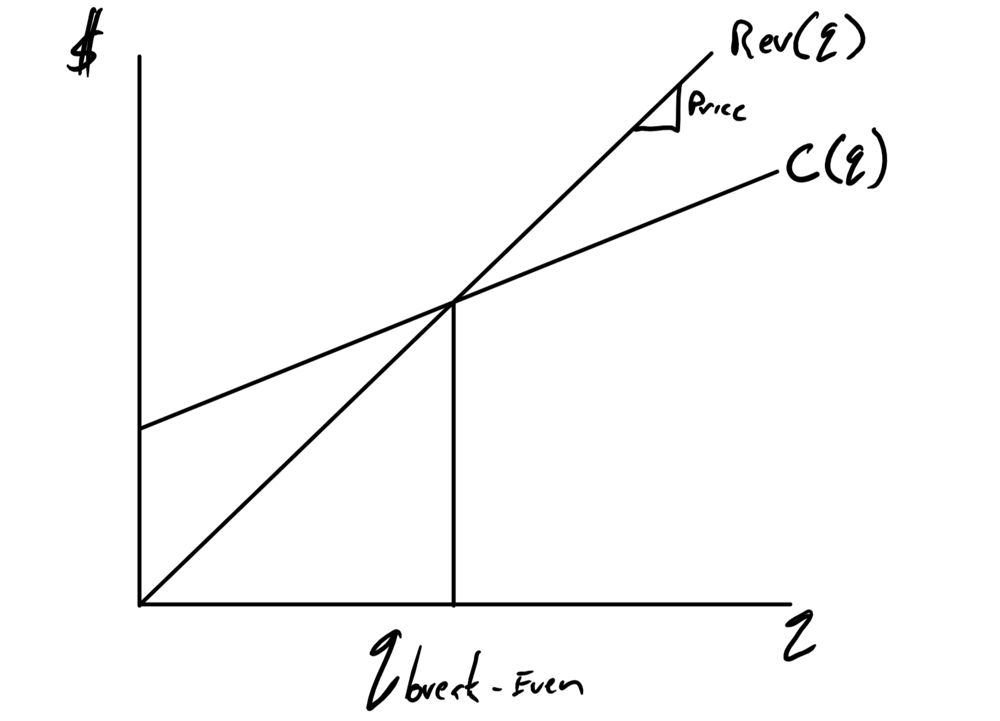

```{r setup, include=FALSE}
knitr::opts_chunk$set(echo = FALSE)
```


## Goals

+ Quick introduction to the problem of the firm.
+ Cost function descriptions
+ The concept of a volume index
+ Solutions to the three single period problems:
    + Break-Even
    + Make vs Buy
    + Optimal Pace
    
## Types of Costs

Economists recognize several types of cost:

+ Sunk: in the past and can not be recovered. Example, One time licencing fee. 
+ Fixed: Costs uncorrelated or do not change over large changes in output. Example, monthly rent
+ Variable: Costs that are correlated with or do increase with increases in output. Example, food costs

Accountants recognize one more kind of cost -- semi-variable

+ Has a fixed and variable component. Example, fully loaded labor cost with insurance.
+ Economists would break this up into a fixed and variable component.

## Contrasts between Economists and Accountants

+ Economists tend to include opportunity cost -- what you could have done. Example, instead of using the building you own for your business, you could have rented it out.
+ Economists tend to view costs as a random variable.  We do stats after we get the numbers and report parameter estimates with uncertainty.

## Costs


## Simplified Assumptions for this Class

$$C = F + \alpha q$$


## Derived Costs

It is often useful to transform these costs into a more useful form.  The two primary transformations  are:

+ Average : $\frac{Some~Cost}{q}$
+ Incremental or Marginal:
    + Marginal $Cost`(q)$
    + Incremental$Cost(q+1) - Cost(q)$, the additional cost to produce one more.

These generalize to  multiple dimensions.  We will focus on incremental costs rather than marginal because no calculus.

## Average Costs

Divide cost by q to get *an* average cost function.

+ Average Fixed Cost : $\frac{F}{q}$
+ Average Variable Cost : $\frac{Variable~Cost}{q} = \frac{\alpha q}{q}= \alpha$
+ Average (Total) Cost: $\frac{Total~Cost}{q} = \frac{F + \alpha q}{q}= \frac{F}{q} + \alpha$


## Average Fixed Cost
$$AFC = \frac{F}{q}$$


## Average Variable Cost

$$AVC = \frac{\alpha q}{q}
= \alpha$$




## Average Cost

$$AC =  AFC + AVC = \frac{F}{q} + \alpha$$
 



## Real Life Average Cost: Theoretical

Spikes happen because of big capital investments.


## Real Life Average Cost: Statistical

We observe lots of bad luck and must estimate potential costs (Frontier regression)



## Incremental Costs

In intro micro (EC 201) you learned about marginal cost, $C(q)'$

+ Incremental cost is the generalization to discrete changes in multiple dimensions.
+ We will stick to the "Additional cost to produce one more" interpretation.
+ You can talk about:
    + the incremental cost of adding a worker.
    + Incremental cost  of adding a shift
    + Incremental cost of adding a new product line.
    
Note that with our assumptions: $IC(q) = \alpha$

$$IC(q) = C(q+1) - C(q) = (F + \alpha q + \alpha) -(F + \alpha q )$$


## Volume Index

+ Not all measures of output are simple 
    + 1 MMbbl oil.
+ Sometimes you have choices
    + 500 plates
    + 300 tickets
    + \$2500 in food costs (Yes, quantity is sometimes measure like this.)
+ Sometimes you have to combine more than one measure
    + Gross Domestic Product
    + kW, kWh

## Choice of Volume Index

+ Ideally, your volume index will be highly correlated with both costs and benefits (Costs and Revenue)
    + Not always the case
    + Often get one but not the other.
+ Uncertainty about costs and/or benefits will be small for a known value of volume index.    

## Example

Needed a volume index for auto insurance cost by zip code for a study of alternative funding mechanisms. 

I picked number of  insured vehicles.

+ Positively correlated with revenue -- premium revenue. 
+ Positively correlated with costs -- accident cost.

## Example Volume Index



## Refinements

+ Large uncertainty for number of  vehicles
+ Missed a lot:
    + Urban vs Rural: Lots of small accidents vs few catastrophic.
    + Sources of the cost per claim
    + Different risks based on driving habits.
    
## Refinements (Con't)

Starting with number of insured vehicles

+ Vehicle Miles Traveled (VMT)
    + More correlated with risk, more driving more accidents.
    + Worked better.
+ Passenger Miles Traveled (PMT)
    + Better correlation with source of costs, medical rather than the vehicle.
    + Worked way better.


## Finding better Volume Indexes


## The "Right" volume index 

+ Finding the right volume index will really reduce the uncertainty of your cost estimates.
+ Only when you are working with historical data of costs/benefits in a regression style model.
+ This is an engineer/economist split on technical approach, i.e., The "estimate" vs "estimate" confusion.
    + Engineers estimate: Some calculated value based on assumed values.
    + Economist estimate: Statistical estimate.

## The Single-Period Choice Problems

+ Break-Even: Find output such that benefits are equal to costs

$$ B(q)= c(q)$$

+ Make vs Buy:  Find the lowest cost technology given a known quantity.

+ Optimal Pace: Find the quantity that maximizes net benefits.

$$ \max_q B(q)- c(q)$$ 

## Break-Even Problem



## Break-Even

+ This is the go back to bed problem.
    + If the break-even is huge, don't do it and go back to bed.
    + If the break-even is small, don't worry about it and go back to bed.


## Example From a Student

San Antonio River Walk Sunglasses Shack

+ 5K a month rent for the spot
+ Figure $10 for sunglasses, counterfeit, wholesale.
+ Sales price of $100 per (This is the River Walk)

## Cost and Revenue Function

$$C = 5000 + 10 q$$
$$ R = 100 q$$

Solve for q such that revenue equals cost
\begin{equation*}
\begin{split}
5000 + 10 q= 100q\\
5000 = 90q\\
q= \frac{5000}{90} = `r round(5000/90,2)`
\end{split}
\end{equation*}

About 2 a day.  Go back to bed.


## Make vs Buy Problem


## Fancy Way of Saying, "Do it the cheap way."

Example:  Trimet Monthly Pass  vs Daily Ticket

+ Monthly Pass: $C_M = 100$
+ Day Pass: $C_D = 5 q$

How often do you go to class?

+ 2 days a week:  $C_M = 100$, $C_D= 5(8)=40$
+ 6 days a week:  $C_M = 100$, $C_D= 5(24)=120$

You have to really think about uncertainty if you go 5 days a week, $C_M = C_D$.

## Optimal Pace Problem


## Looks Very Similar to Increasing Cost of Funds

+ Same shape requirements
    + IC must be non-decreasing
    + IB must be non-increasing
    + At least one must be strict, i.e., IC increasing or IB decreasing.
    
+ Pretty flexible idea 


## Stooges Example

+ Jobs can only be done today (single period)
+ All workers are equally productive
+ One task per worker only

| Workers | Wages | Tasks | Pay |
|---      |---    |---    |---  |
| Larry | \$9 | Shine Shoes | \$8 |
| Curly | \$5 | Paint a Fence | \$12 |
| Moe | \$7 | Register Voters | \$4 |
| Shemp | \$1 | Wait Tables | \$5 |
| Joe | \$2 | Babysit | \$14 |

## Get them in the right order

| Workers | Wages | Tasks | Pay |
|---      |---    |---    |---  |
| Shemp | \$1 |Babysit | \$14 |
| Joe | \$2 | Paint a Fence | \$12 |
| Curly | \$5 | Shine Shoes | \$8 |
| Moe | \$7 | Wait Tables | \$5 |
| Larry | \$9 | Register Voters | \$4 | 

+ Incremental Costs from low to high
+ Incremental Benefits from high to low
+ Do all the tasks where IC<IB.

## Only Do these

| Workers | Wages | Tasks | Pay | Do it|
|---      |---    |---    |---  |---  |
| Shemp | \$1 |Babysit | \$14 | Yes |
| Joe | \$2 | Paint a Fence | \$12 | Yes |
| Curly | \$5 | Shine Shoes | \$8 | Yes   |
| Moe | \$7 | Wait Tables | \$5 |   |
| Larry | \$9 | Register Voters | \$4 |   | 

Net Benefits are: $(14 + 12 +8)- (1 +2 +5) = `r  (14 + 12 +8)- (1 +2 +5)`$

## Note you could do it wrong

If you don't get the curvature right you can employ everyone and do all the tasks.

| Workers | Wages | Tasks | Pay |
|---      |---    |---    |---  |
| Shemp | \$1 |Register Voters | \$4 |
| Joe | \$2 | Wait Tables | \$5 |
| Curly | \$5 | Shine Shoes | \$8 |
| Moe | \$7 | Paint a Fence | \$12 |
| Larry | \$9 | Babysit | \$14 |

But the net benefits are less:
$$(14+12+8+5+4)-(9+7+5+2+1)=`r (14+12+8+5+4)-(9+7+5+2+1)`$$

