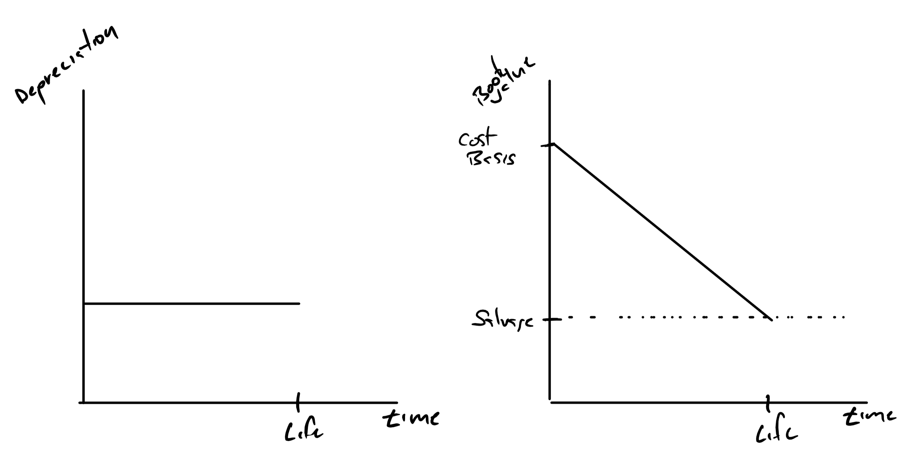
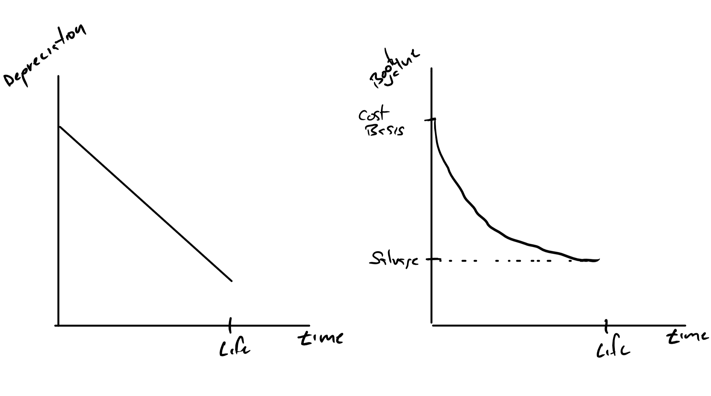

```{r setup, include=FALSE}
knitr::opts_chunk$set(echo = FALSE)
```


## Goals

+ Reintroduction of the accounting material we left behind after accounting ratios.
+ Use the choice tools with less abstraction and more realism.

## Keep in Mind

This is an area for experts.  The IRS puts out new rules and interpretations all the time.

https://apps.irs.gov/app/picklist/list/internalRevenueBulletins.html

These are just the cliffs notes version.  

+ You may have the basics but what do you do with pistachio trees or when the soil is more than 50% sand and you just did some land prep?
+ Hire an expert.
+ We are here to have an appreciation for what the experts do.

## What is Depreciation

There are a few ways of describing it:

+ The reduction in value of an asset because of the passage of time.
    + How most people think of depreciation.
    + Commingles depreciation with price changes in marking asset values to market.
    + Common definition.
+ A way of allocating the cost of an asset over its useful life.
    + A better description of what we do.
    + It is just an algorithm for allocating costs over time.

## The first kind, impairment or mark to market

+ What layperson first thinks of.
+ This is what happens when something drastic happens.
    + You change the way you use an asset.
    + Market crash, like real estate
    + Big changes in asset life.
    
We will not look at this in class.


## Other Accounting Concepts that Look Like Depreciation

+ Amortization is similar to depreciation but for non-tangible assets like patents, goodwill and the like.
+ Depletion for when you pull sand, oil, gold and lumber out of the ground (https://www.irs.gov/publications/p535/ch09.html)
    + This works much differently than depreciation and amortization.
    + Usually a fraction of other costs or separate estimate per, for example board foot.
    

## Why Depreciate?

To stop people from making bad decisions because they are not matching costs to benefits.

+ The matching principle, "Report *expenses* in the same period as the related revenues."
+ Buying an asset is not an expense, you divide up the purchases price over the life of the asset to get the expenses.


Example:  The Banner

+ A banner lasts three years.
+ The PEF board ran an auction, allocated the full cost to the first year.
+ They almost didn't have a second year.
+ 2017 was the 14th year.

## What to Depreciate

Assets used for business purposes that have a determinable life of greater than a year that decays, wears away, gets used up, becomes obsolete, or loses value to the owner.

+ Lots of reasons for depreciation of the first type.
+ Keep in mind that short-lived things don't depreciate.
+ Small asset purchases are frequently just treated as an expense.
+ Land ... mostly not depreciated.

## What Do you Need to Know to Depreciate

+ Cost basis
+ Salvage Value
+ Service Date
+ Service Life
+ Method

    
## Cost basis

+ Please note that this is not "cost".
+ Cost basis includes everything you need to get the asset functioning.
    + Includes transportation.
    + Includes installation costs.
    + etc.

Example:  Buy a charter sailboat
    + Cost of the boat: 250K
    + Transport it from SFO to PDX: 10K
    + Repairs to electrical: 5K
    + Cost basis: 265K


## Salvage Value

+ This is how much the asset is worth at the end of its *assumed* life.
+ This is an *assumed* value.
+ Yes, *assumed* is used a lot.


## Service Date

+ Date the asset was first able to be used.
    + Not the day it was used.
    + Not the day you bought it.
+ Example: Buy a rental house on January 5th.
    + Can't rent it out because the roof was shot.
    + The roof is fixed on April 1st.
    + First rented on May 1st.
    
The service data is April 1st, when it is able to be used.

## Service Life

How long an asset will last before it will be salvaged.

+ This does not mean it is non-functional -- it could be.
+ It could also be obsolete.

How long?

+ Back in the day the IRS would have a case to determine how long an asset lasted for tax purposes.
+ These days they have tables (https://www.irs.gov/publications/p946/ar02.html#d0e10880) table B-2 and below.

## Method

It is easiest to think of method as a formula to allocate the reduction in value from cost basis to salvage value over the life of the asset.

The common approaches are:

+ Straight line
+ Declining balance methods.

## Key Term Book Value

+ Depreciation: Reduction in value each year.
+ Book Value: Cos basis less accumulated depreciation.

## Straight Line Depreciation

$$D_t = \frac{Cost~Basis - Salvage}{Life}$$

{scale=75%}

## Straight Line Tabular Example

Five-year asset with cost basis of 11K and Salvage of 1K.

Year| Depreciation  | Book Value|
----|------         |-----      |
1   |2K             |9K         |
2   |2K             |7K         | 
3   |2K             |5K         |
4   |2K             |3K         |
5   |2K             |1K         |

## Accelerated Depreciation

Just means more depreciation earlier.



## Declining Balance Depreciation (A Kind of Accelerated)

$$D_t = B_{t-1}\frac{1}{Life}$$

```{r}

Cost <- 11
D1 <- Cost/5
B1 <- Cost - D1
D2 <- B1/5
B2 <- B1 - D2
D3 <- B2/5
B3 <- D2 - D3
D4 <- B3/5
B4 <- B3 - D4
D5 <- B4/5
B5 <- B4 - D5

```

Year| Depreciation              | Book Value|
----|------                     |-----      |
1   |$\frac{11K}{5} = `r D1`K$      |$`r B1`K$         |
2   |$\frac{`r B1`K}{5} = `r D2`K$  |$`r B2`K$         | 
3   |$\frac{`r B2`K}{5} = `r D3`K$  |$`r B3`K$         |
4   |$\frac{`r B3`K}{5} = `r D4`K$  |$`r B4`K$         |
5   |$\frac{`r B4`K}{5} = `r D5`K$  |$`r B5`K$         |

Note that Salvage Value is not in the equation.  You need to modify this to reach the salvage value


## Variants Double Declining Balance etc.


$$D_t = B_{t-1}\frac{2}{Life}$$

```{r}

Cost <- 11
D1 <- 2 * Cost/5
B1 <- Cost - D1
D2 <- 2 * B1/5
B2 <- B1 - D2
D3 <- 2 * B2/5
B3 <- D2 - D3
D4 <- 2 * B3/5
B4 <- B3 - D4
D5 <- 2 * B4/5
B5 <- B4 - D5

```

Year| Depreciation              | Book Value|
----|------                     |-----      |
1   |$11K \frac{2}{5} = `r D1`K$      |$`r B1`K$         |
2   |$`r B1`K \frac{2}{5} = `r D2`K$  |$`r B2`K$         | 
3   |$`r B2`K \frac{2}{5} = `r D3`K$  |$`r B3`K$         |
4   |$`r B3`K \frac{2}{5} = `r D4`K$  |$`r B4`K$         |
5   |$`r B4`K \frac{2}{5} = `r D5`K$  |$`r B5`K$         |

## One way to hit salvage value

If Declining balance would take the book value below the salvage value before the end of the service life.  Stop when you get to the salvage value. Example with Salvage of 1K.

Year| Depreciation              | Book Value|
----|------                     |-----      |
1   |$\frac{11K}{5} = `r D1`K$      |$`r B1`K$         |
2   |$\frac{`r B1`K}{5} = `r D2`K$  |$`r B2`K$         | 
3   |$`r B2-1`K$  |$1K$         |
4   |$0K$  |$1K$         |
5   |$0K$  |$1K$         |


## How DB uses Straight Line.

We are not going to do this in class. We will focus on tax depreciation through the Modified Accelerated Cost Recovery System (*MACRS*)


If declining balance will not get you to salvage value, you switch to straight line from declining balance when straight line -- at current book value and remaining life -- is greater than declining balance.

## Book vs Tax Depreciation

+ Yes, accountants do depreciation many ways.
+ There are two sets of books, one for tax purposes and one for use internally and by the financial markets.
+ This is not like coded accounts where "Produce" is actually an account for bribes.

## Why Two Sets of Books

+ Accountants have two tasks:
    + Accurately convey the state of the business.
    + Minimize taxes.
+ They can't do both at the same time:
    + IRS says a car lasts 5 years.
    + You know it will last 15.
    + Either pay more taxes or give bad information to shareholders and management.
  
The solution is two sets of books.  

## In Class

+ We will focus on depreciation for tax purposes     
+ We will pretend that book depreciation and tax depreciation are the same.  
+ They rarely are.

## MACRS

+ Assumed salvage value is zero.
    + Gives advantage of more early depreciation.
    + Considered an investment stimulus.
    + We true up with "depreciation recapture" at sale
+ Lives are given by table.
    + Lives are typically shorter than reality.
    + Again, tax advantageous.
    + Only a few categories
+ Method is one of the declining balance methods
    + Salvage value of zero makes uniform tables possible.
    + Simplifies the depreciation calculations.

## A Note on Time Conventions

There are three:

+ Mid-year: Assets that are not real estate.
+ Mid-Month: Structures
+ Mid-Quarter: Alternative for assets that are not real estate.

Mid-year:

+ No matter when you buy the asset, Jan 1 or Dec 1, get a half a  year of depreciation.
+ No matter when you sell the asset, get half a year.

## Why the time conventions

+ They keep the buyer and the seller from fighting over the service date for tax purposes.
    + Advantage to seller to have a later date.
    + Advantage to buyer to have an earlier date.
+ Real estate is strange and big.
+ Mid-quarter is there to keep exploiting the obvious tax savings of buying lots of assets at the end of the year and getting half a year of depreciation.